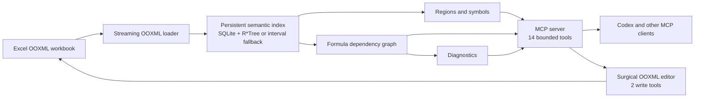

# Excel LSP

<!-- mcp-name: io.github.Brody900/excel-lsp -->

An LSP for Excel: semantic index + MCP server so AI agents navigate workbooks by symbols, references, and diagnostics — not by reading 50,000 rows.

*(LSP-style: the ideas — symbols, references, diagnostics, incremental index — not the LSP wire protocol.)*


*Measured release evidence: Excel LSP used 3,410 deterministic tool-result
tokens versus 222,289 for naive dump—a **65.2× reduction**—and answered 12/12
headless runs exactly versus 8/12. Full Codex CLI usage, which includes fixed
agent context and schemas, is reported separately in the
[raw rows](benchmarks/results/README.md).*

## 60-second lineage demo


The demo is assembled only from the numbered desktop-Excel captures. Its
[evidence manifest](docs/evidence/live-excel/demo-capture.json) records every
source hash, the output hash, dimensions, and frame duration; the complete
[live protocol index](docs/evidence/live-excel/index.md) records the matching
machine-readable assertions.

## Quickstart

Excel LSP requires Python 3.11 or newer and runs as a local stdio process. It
does not require Microsoft Excel for indexing or editing OOXML files.

### Run the MCP server

The verified public-repository install works now:

```console
uvx --from git+https://github.com/Brody900/excel-lsp@main excel-lsp serve
```

After the PyPI publication is visible, the shorter equivalent is:

```console
uvx excel-lsp serve
```

### Add Excel LSP to Codex

```console
codex mcp add excel-lsp -- uvx --from git+https://github.com/Brody900/excel-lsp@main excel-lsp serve
codex mcp get excel-lsp
```

Codex will launch the stdio server when it needs it; Excel LSP is not a network
daemon. The shorter PyPI registration is
`codex mcp add excel-lsp -- uvx excel-lsp serve`. That syntax was verified with
Codex CLI 0.144.5 in an isolated configuration home.

### Configure Codex manually

Add the following entry to `~/.codex/config.toml`:

```toml
[mcp_servers.excel-lsp]
command = "uvx"
args = ["--from", "git+https://github.com/Brody900/excel-lsp@main", "excel-lsp", "serve"]
```

A copy is available at [`examples/codex.config.toml`](examples/codex.config.toml).

<details>
<summary>Generic <code>.mcp.json</code> for clients that use MCP JSON configuration</summary>

```json
{
  "mcpServers": {
    "excel-lsp": {
      "command": "uvx",
      "args": ["--from", "git+https://github.com/Brody900/excel-lsp@main", "excel-lsp", "serve"]
    }
  }
}
```

This is a generic MCP-client example, not Codex's native configuration format.
It is also committed as [`examples/mcp.json`](examples/mcp.json).

</details>

## Tools

The contracts below are frozen for v0.1.0 and verified by the completed P7
milestone. Exact generated schemas and one worked example per tool are in the
[tool reference](docs/tool-reference.md).

| Tool | What it gives an agent |
|---|---|
| `open_workbook` | Index or refresh a workbook and return its compact semantic map. |
| `refresh` | Explicitly resynchronize the index and optionally clear recalculated staleness. |
| `list_symbols` | Search sheets, regions, columns, formula blocks, names, and cells by stable symbol ID. |
| `get_region_schema` | Inspect headers, types, validation, formula blocks, confidence, and bounded samples. |
| `read_range` | Read a small, paginated range with a hard limit of 200 values per response. |
| `find` | Search bounded snippets across values, headers, formulas, and defined names. |
| `trace_precedents` | Trace what a cell or symbol reads, with bounded depth and node counts. |
| `trace_dependents` | Trace what a cell or symbol can affect, with bounded depth and node counts. |
| `trace_path` | Explain bounded dependency paths between two cells or symbols. |
| `explain_formula` | Show A1/R1C1 forms, block membership, resolved references, flags, and diagnostics. |
| `get_diagnostics` | Filter formula and workbook diagnostics by sheet, severity, or code. |
| `profile_column` | Return bounded numeric statistics or top values for a region column. |
| `write_cells` | Surgically write bounded cell values or formulas without workbook round-tripping. |
| `set_column_formula` | Fill a region column formula with formula-block and staleness tracking. |

The first 12 tools are read tools. The final two are destructive write tools
and carry the corresponding MCP annotations so clients can request
confirmation.

## Architecture

The workbook remains authoritative; the SQLite sidecar is a disposable derived
index. Every transport operation delegates to the same core services.



See [the architecture](docs/architecture.md) for implemented boundaries and
phase status.

## Benchmarks

The verified P8 milestone commits the raw rows, exact/set-semantic answer checks, both
headless-Codex repetitions, environment metadata, and scripts that regenerate
every chart. The [raw results index](benchmarks/results/README.md) explains each
artifact and the [methodology](benchmarks/README.md) documents isolation,
grading, cost guards, and the optional-arm exclusion.

### Results

| Arm | Exact answers | Accuracy | Mean full CLI tokens |
|---|---:|---:|---:|
| Excel LSP | 12/12 | 100.0% | 77,310.5 |
| Naive dump | 8/12 | 66.7% | 64,909.8 |

Excel LSP meets S5 on its defined deterministic payload metric: 3,410 tokens
versus 222,289, a **65.2× reduction**, with equal-or-better headless accuracy.
The disclosed 1,000-row archive workload is identical across arms and every
original OOXML member stays byte-identical except package declarations and
F03's deliberately extended Summary XML; a regression separately proves every
pre-existing Summary cell, formula, and cache is unchanged. Mean full Codex usage was 77,310.5
versus 64,909.8 because that secondary measure includes fixed agent context,
schemas, and reasoning; it is reported rather than conflated with workbook
payload. See the [criterion calculation](docs/evidence/success-criteria.md#s5)
and [per-repetition table](benchmarks/results/accuracy.md).


The 50,000-row median is 9.440 seconds cold and 0.066 seconds after a
one-sheet change, satisfying S1's strict 10-second and 1-second limits.

### Reproduce

Run the deterministic twelve-row replay with:

```console
excel-lsp bench
```

For a fresh headless run and regenerated timing/charts, follow the commands in
the [benchmark methodology](benchmarks/README.md#reproduction). Headless runs
consume account capacity; use a new JSONL path instead of overwriting the
committed evidence.

## Comparison

This is a capability comparison, not an overall ranking. Upstream observations
are limited to each project's README at a pinned revision accessed 2026-07-29;
“not documented” does not mean impossible. See the
[source notes and exact revisions](docs/evidence/comparison-sources.md).

| Capability | Excel LSP | haris-musa/excel-mcp-server | jwadow/mcp-excel | Naive dump baseline |
|---|---|---|---|---|
| Persistent semantic index | [SQLite semantic index](docs/evidence/p1-foundation.md#delivered-contracts) | Not documented | Smart cache documented; persistent semantic index not documented | None |
| Formula dependency graph | [Bidirectional, bounded traces](docs/evidence/p4-graph.md#delivered-contracts) | Not documented | Not documented | None |
| Incremental reindex | [Part-hash driven and measured](docs/evidence/p1-foundation.md#invariant-evidence) | Not documented | Not documented | Reopens workbook per request |
| Formula diagnostics | [Typed catalog](docs/evidence/p5-diagnostics.md#diagnostic-matrix) | Formula/range validation documented; diagnostic catalog not documented | Not documented | None |
| Edit support and untouched-part fidelity | [2 narrow writes; untouched ZIP parts byte-identical](docs/evidence/p6-editor.md#part-preservation) | Broad edits documented; byte-identity claim not documented | Read-only; writes on roadmap | Read-only |
| Token discipline | Hard response caps; [65.2× less measured workbook payload](docs/evidence/success-criteria.md#s5) | Comparable caps not documented | Context limits and bounded previews documented | Full CSV dump |

## How it works

P2 adds sparse region detection without constructing dense grids. Native Excel
ListObjects take precedence; otherwise bounded header, type, style, merge, and
density features produce a region and an explicit confidence score. See
[the architecture](docs/architecture.md).

Verified P3 normalizes copied formulas into R1C1 signatures
and groups matching cells into formula blocks. That design lets an agent reason
about a large calculated column as one semantic unit while preserving
cell-level references and anomalies. See
[the P3 evidence](docs/evidence/p3-formulas-blocks.md) and
[index internals](docs/index-internals.md).

P4 stores formula range dependencies as rectangles in SQLite R*Tree, with a
portable interval-table fallback. Point and range queries then feed bounded
precedent, dependent, path, and diagnostic operations without expanding every
range into individual edges. See [index internals](docs/index-internals.md).

## Security & scope

The local stdio server makes no runtime network requests and supports
realpath-resolved workbook confinement.

The P6 core edit services surgically modify targeted worksheet XML and required
calculation metadata. Complete F16/F21 part manifests and a property test prove
that every OOXML part not deliberately modified stays byte-identical in the
verified implementation. `EXCEL_LSP_ROOT` provides an optional
`os.pathsep`-separated directory allowlist applied after realpath resolution.
Its default is unrestricted
local-path access. See [SECURITY.md](SECURITY.md) for the current threat model
and implementation status.

## Limitations and roadmap

### Limitations

Header-confidence behavior is implemented in P2. Formula-analysis limitations
are verified P3 behavior; later-phase bullets remain planned release behavior.

- **P6 core verified; P8 live evidence captured:** Excel LSP does not recalculate
  formulas; it reads cached values and delegates recalculation to Excel.
- **Verified P3/P5:** `INDIRECT` and other
  dynamic references are flaggable but opaque to static dependency analysis.
- Header inference is heuristic and can be wrong; every inferred region exposes
  a confidence score.
- **P6 verified:** Written strings use OOXML inline strings, which Excel and
  LibreOffice support but some third-party tools handle poorly.
- **P6/P7 verified:** Datetime cell writes are
  rejected in v0.1.0.
- **P6/P7 verified:** Writes inside multi-cell array
  formulas are refused.
- **Verified P3:** Dynamic-array spill extents are not statically
  tracked.

### Non-goals for v0.1.0

- No chart or pivot-table creation.
- No rename refactoring.
- No Google Sheets adapter.
- No `.xls` or `.xlsb` support.
- No collaborative or live editing.
- No runtime network access.
- No telemetry.

### Roadmap

- **Flagship v1.x item:** rename refactoring for sheets, columns, and defined
  names with workbook-wide formula rewrites, powered by the dependency graph.
- A real LSP wire-protocol server for formula editing in editors.
- Multi-workbook workspaces that connect external-link graph edges.
- Value-level workbook diff.
- Watch mode.
- `.xlsb` support.
- A Google Sheets adapter.
- Datetime writes and content-addressed region aliases.

## Evidence

Start with the [evidence index](docs/evidence/README.md). It distinguishes
verified artifacts from scope declarations and links the exhaustive
[README claims-to-artifacts matrix](docs/evidence/readme-claims-to-artifacts.md),
[clean-install report](docs/evidence/fresh-install.md), and
[registry submission packet](docs/registry-submissions.md).

Not affiliated with Microsoft. Excel is a trademark of Microsoft Corporation.
