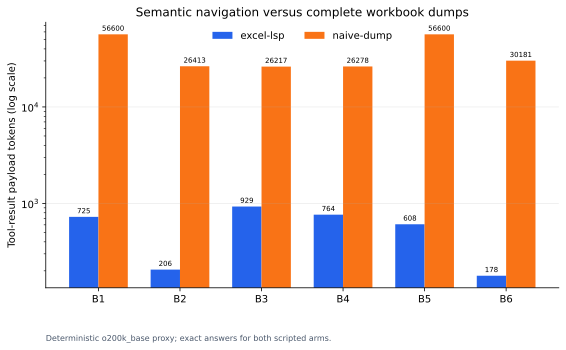
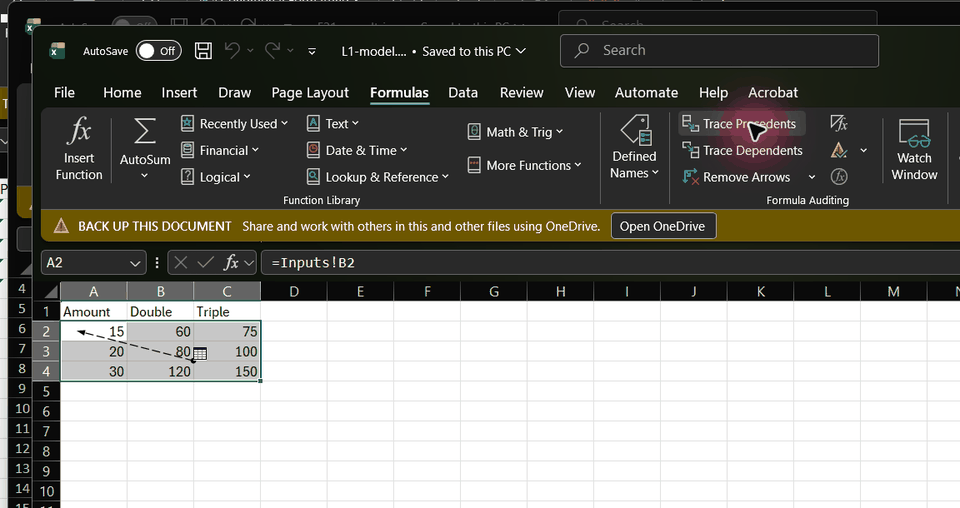
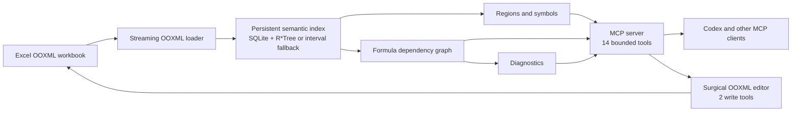
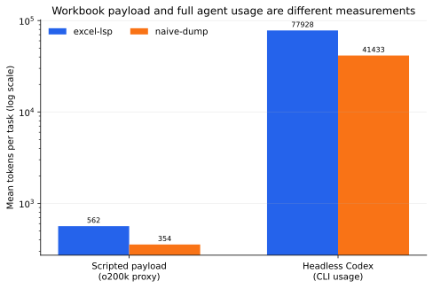
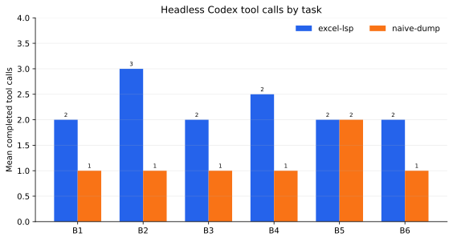
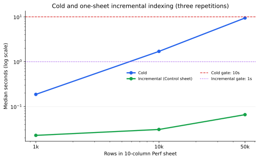
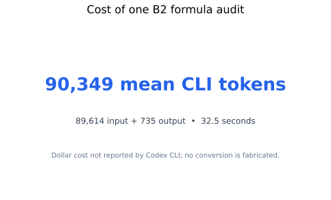

# Excel LSP

An LSP for Excel: semantic index + MCP server so AI agents navigate workbooks by symbols, references, and diagnostics — not by reading 50,000 rows.

*(LSP-style: the ideas — symbols, references, diagnostics, incremental index — not the LSP wire protocol.)*



*Measured P8 milestone: Excel LSP answered 12/12 runs exactly versus 9/12 for
naive dump, but used 1.881× the baseline's mean full CLI tokens. The frozen S5
token-reduction criterion fails; the chart and [raw rows](benchmarks/results/README.md)
keep that unfavorable result visible.*

> **Development status:** Excel LSP is under active development toward v0.1.0.
> The parser, index, regions, formula navigation, graph, diagnostics, surgical
> editor, 14-tool MCP/CLI surface, live-Excel protocol, and benchmark evidence
> are verified through P8. Clean-install and release evidence remains gated to
> P9.

## 60-second lineage demo



The demo is assembled only from the numbered desktop-Excel captures. Its
[evidence manifest](docs/evidence/live-excel/demo-capture.json) records every
source hash, the output hash, dimensions, and frame duration; the complete
[live protocol index](docs/evidence/live-excel/index.md) records the matching
machine-readable assertions.

## Quickstart

> **Planned v0.1.0 quickstart.** These commands are not yet a released install
> path. The P9 release gate will remove this notice only after the `uvx` path and
> Codex registration both succeed in a clean environment.

### Run the MCP server

```console
uvx excel-lsp serve
```

### Add Excel LSP to Codex

```console
codex mcp add excel-lsp -- uvx excel-lsp serve
codex mcp get excel-lsp
```

Codex will launch the stdio server when it needs it; Excel LSP is not a network
daemon. The P9 gate will verify and capture this syntax against the then-current
Codex CLI before the pre-release notice is removed.

### Configure Codex manually

Add the following entry to `~/.codex/config.toml`:

```toml
[mcp_servers.excel-lsp]
command = "uvx"
args = ["excel-lsp", "serve"]
```

A copy is available at [`examples/codex.config.toml`](examples/codex.config.toml).

<details>
<summary>Generic <code>.mcp.json</code> for clients that use MCP JSON configuration</summary>

```json
{
  "mcpServers": {
    "excel-lsp": {
      "command": "uvx",
      "args": ["excel-lsp", "serve"]
    }
  }
}
```

This is a generic MCP-client example, not Codex's native configuration format.
It is also committed as [`examples/mcp.json`](examples/mcp.json).

</details>

## Tools

The contracts below are frozen for v0.1.0 and verified by the completed P7
milestone. Exact generated schemas and one worked example per tool are in the
[tool reference](docs/tool-reference.md).

| Tool | What it gives an agent |
|---|---|
| `open_workbook` | Index or refresh a workbook and return its compact semantic map. |
| `refresh` | Explicitly resynchronize the index and optionally clear recalculated staleness. |
| `list_symbols` | Search sheets, regions, columns, formula blocks, names, and cells by stable symbol ID. |
| `get_region_schema` | Inspect headers, types, validation, formula blocks, confidence, and bounded samples. |
| `read_range` | Read a small, paginated range with a hard limit of 200 values per response. |
| `find` | Search bounded snippets across values, headers, formulas, and defined names. |
| `trace_precedents` | Trace what a cell or symbol reads, with bounded depth and node counts. |
| `trace_dependents` | Trace what a cell or symbol can affect, with bounded depth and node counts. |
| `trace_path` | Explain bounded dependency paths between two cells or symbols. |
| `explain_formula` | Show A1/R1C1 forms, block membership, resolved references, flags, and diagnostics. |
| `get_diagnostics` | Filter formula and workbook diagnostics by sheet, severity, or code. |
| `profile_column` | Return bounded numeric statistics or top values for a region column. |
| `write_cells` | Surgically write bounded cell values or formulas without workbook round-tripping. |
| `set_column_formula` | Fill a region column formula with formula-block and staleness tracking. |

The first 12 tools are read tools. The final two are destructive write tools
and carry the corresponding MCP annotations so clients can request
confirmation.

## Architecture

The loader and index are implemented. The diagram also shows the gated P2-P7
components that complete the v0.1.0 design.



See [the architecture](docs/architecture.md) for implemented boundaries and
phase status.

## Benchmarks

The verified P8 milestone commits the raw rows, exact/set-semantic answer checks, both
headless-Codex repetitions, environment metadata, and scripts that regenerate
every chart. The [raw results index](benchmarks/results/README.md) explains each
artifact and the [methodology](benchmarks/README.md) documents isolation,
grading, cost guards, and the optional-arm exclusion.

### Results

| Arm | Exact answers | Accuracy | Mean full CLI tokens |
|---|---:|---:|---:|
| Excel LSP | 12/12 | 100.0% | 77,927.8 |
| Naive dump | 9/12 | 75.0% | 41,432.8 |

Excel LSP is more accurate on this small suite, but it does not reduce tokens:
scripted payload totals are 3,375 versus 2,127 and mean full Codex usage is
77,927.8 versus 41,432.8. Therefore S5 fails even though its accuracy clause
passes. See the [criterion calculation](docs/evidence/success-criteria.md#s5)
and [per-repetition table](benchmarks/results/accuracy.md).









The 50,000-row median is 9.440 seconds cold and 0.066 seconds after a
one-sheet change, satisfying S1's strict 10-second and 1-second limits.

### Reproduce

Run the deterministic twelve-row replay with:

```console
excel-lsp bench
```

For a fresh headless run and regenerated timing/charts, follow the commands in
the [benchmark methodology](benchmarks/README.md#reproduction). Headless runs
consume account capacity; use a new JSONL path instead of overwriting the
committed evidence.

## Comparison

> **Planned for P9.** Competitor cells remain deliberately ungraded until the
> release review pins an upstream revision, access date, and source for every
> observation. “Not observed at the pinned revision” will not be presented as
> proof that a feature is impossible.

| Capability | Excel LSP | haris-musa/excel-mcp-server | jwadow/mcp-excel | Naive dump baseline |
|---|---|---|---|---|
| Persistent semantic index | [P1 evidence available](docs/evidence/p1-foundation.md#delivered-contracts) | Source review pending | Source review pending | P8 baseline pending |
| Formula dependency graph | [P4 evidence available](docs/evidence/p4-graph.md#formal-phase-gate) | Source review pending | Source review pending | P8 baseline pending |
| Incremental reindex | [P1 evidence available](docs/evidence/p1-foundation.md#invariant-evidence) | Source review pending | Source review pending | P8 baseline pending |
| Formula diagnostics | [P5 evidence available](docs/evidence/p5-diagnostics.md#formal-phase-gate) | Source review pending | Source review pending | P8 baseline pending |
| Edit support and untouched-part fidelity | [P6 verified evidence available](docs/evidence/p6-editor.md#part-preservation) | Source review pending | Source review pending | P8 baseline pending |
| Token discipline | [P8 measured: no reduction; S5 fails](docs/evidence/success-criteria.md#s5) | Source review pending | Source review pending | [Measured reference arm](benchmarks/results/README.md) |

## How it works

P2 adds sparse region detection without constructing dense grids. Native Excel
ListObjects take precedence; otherwise bounded header, type, style, merge, and
density features produce a region and an explicit confidence score. See
[the architecture](docs/architecture.md).

Verified P3 normalizes copied formulas into R1C1 signatures
and groups matching cells into formula blocks. That design lets an agent reason
about a large calculated column as one semantic unit while preserving
cell-level references and anomalies. See
[the P3 evidence](docs/evidence/p3-formulas-blocks.md) and
[index internals](docs/index-internals.md).

P4 stores formula range dependencies as rectangles in SQLite R*Tree, with a
portable interval-table fallback. Point and range queries then feed bounded
precedent, dependent, path, and diagnostic operations without expanding every
range into individual edges. See [index internals](docs/index-internals.md).

## Security & scope

> **Pre-release security boundary; P7 is verified and P9 release verification
> remains pending.** The local stdio server makes no runtime network requests and
> supports realpath-resolved workbook confinement.

The P6 core edit services surgically modify targeted worksheet XML and required
calculation metadata. Complete F16/F21 part manifests and a property test prove
that every OOXML part not deliberately modified stays byte-identical in the
verified implementation. `EXCEL_LSP_ROOT` provides an optional
`os.pathsep`-separated directory allowlist applied after realpath resolution.
Its default is unrestricted
local-path access. See [SECURITY.md](SECURITY.md) for the current threat model
and implementation status.

## Limitations and roadmap

### Limitations

Header-confidence behavior is implemented in P2. Formula-analysis limitations
are verified P3 behavior; later-phase bullets remain planned release behavior.

- **P6 core verified; P8 live evidence captured:** Excel LSP does not recalculate
  formulas; it reads cached values and delegates recalculation to Excel.
- **Verified P3/P5:** `INDIRECT` and other
  dynamic references are flaggable but opaque to static dependency analysis.
- Header inference is heuristic and can be wrong; every inferred region exposes
  a confidence score.
- **P6 verified:** Written strings use OOXML inline strings, which Excel and
  LibreOffice support but some third-party tools handle poorly.
- **P6/P7 verified:** Datetime cell writes are
  rejected in v0.1.0.
- **P6/P7 verified:** Writes inside multi-cell array
  formulas are refused.
- **Verified P3:** Dynamic-array spill extents are not statically
  tracked.

### Non-goals for v0.1.0

- No chart or pivot-table creation.
- No rename refactoring.
- No Google Sheets adapter.
- No `.xls` or `.xlsb` support.
- No collaborative or live editing.
- No runtime network access.
- No telemetry.

### Roadmap

- **Flagship v1.x item:** rename refactoring for sheets, columns, and defined
  names with workbook-wide formula rewrites, powered by the dependency graph.
- A real LSP wire-protocol server for formula editing in editors.
- Multi-workbook workspaces that connect external-link graph edges.
- Value-level workbook diff.
- Watch mode.
- `.xlsb` support.
- A Google Sheets adapter.
- Datetime writes and content-addressed region aliases.

## Evidence

Start with the [evidence index](docs/evidence/README.md). It distinguishes
verified artifacts from named future deliverables and links the exhaustive
[README claims-to-artifacts plan](docs/evidence/readme-claims-to-artifacts.md).

Not affiliated with Microsoft. Excel is a trademark of Microsoft Corporation.
