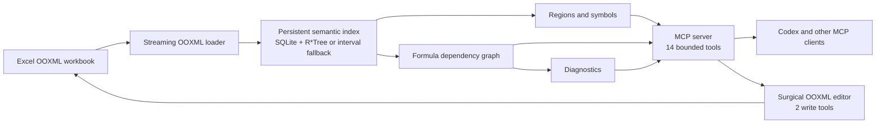

# Excel LSP

An LSP for Excel: semantic index + MCP server so AI agents navigate workbooks by symbols, references, and diagnostics — not by reading 50,000 rows.

*(LSP-style: the ideas — symbols, references, diagnostics, incremental index — not the LSP wire protocol.)*

> **Benchmark hero chart — planned for P8.** Comparative measurements are not
> available yet. This visible placeholder will be replaced by the verified
> grouped token chart only after its raw rows and exact-answer checks are
> committed.

<!-- P8 HERO SLOT: replace the visible placeholder above with docs/assets/benchmark-token-hero.svg. Its alt text must describe the tasks, arms, and log scale. Derive every number in the surrounding copy from committed raw results; do not promise a reduction before the checker output proves it. -->

> **Development status:** Excel LSP is under active development toward v0.1.0.
> The parser, persistent index foundation, sparse regions, stable symbols, and
> compact workbook map are verified through P2. Formula navigation, the MCP
> surface, live-Excel evidence, measured benchmarks, and release-install
> evidence remain later gated work.

## 60-second lineage demo

> **Planned for P8.** The verified live-Excel pass will produce
> `docs/assets/lineage-demo.gif` and a numbered evidence record. No demo has been
> recorded yet.

## Quickstart

> **Planned v0.1.0 quickstart.** These commands are not yet a released install
> path. The P9 release gate will remove this notice only after the `uvx` path and
> Codex registration both succeed in a clean environment.

### Run the MCP server

```console
uvx excel-lsp serve
```

### Add Excel LSP to Codex

```console
codex mcp add excel-lsp -- uvx excel-lsp serve
codex mcp get excel-lsp
```

Codex will launch the stdio server when it needs it; Excel LSP is not a network
daemon. The P9 gate will verify and capture this syntax against the then-current
Codex CLI before the pre-release notice is removed.

### Configure Codex manually

Add the following entry to `~/.codex/config.toml`:

```toml
[mcp_servers.excel-lsp]
command = "uvx"
args = ["excel-lsp", "serve"]
```

A copy is available at [`examples/codex.config.toml`](examples/codex.config.toml).

<details>
<summary>Generic <code>.mcp.json</code> for clients that use MCP JSON configuration</summary>

```json
{
  "mcpServers": {
    "excel-lsp": {
      "command": "uvx",
      "args": ["excel-lsp", "serve"]
    }
  }
}
```

This is a generic MCP-client example, not Codex's native configuration format.
It is also committed as [`examples/mcp.json`](examples/mcp.json).

</details>

## Tools

The contracts below are frozen for v0.1.0. Their MCP implementations and
worked examples are planned for P7, so this table is a product contract rather
than a claim that the server is already complete.

| Tool | What it gives an agent |
|---|---|
| `open_workbook` | Index or refresh a workbook and return its compact semantic map. |
| `refresh` | Explicitly resynchronize the index and optionally clear recalculated staleness. |
| `list_symbols` | Search sheets, regions, columns, formula blocks, names, and cells by stable symbol ID. |
| `get_region_schema` | Inspect headers, types, validation, formula blocks, confidence, and bounded samples. |
| `read_range` | Read a small, paginated range with a hard limit of 200 values per response. |
| `find` | Search bounded snippets across values, headers, formulas, and defined names. |
| `trace_precedents` | Trace what a cell or symbol reads, with bounded depth and node counts. |
| `trace_dependents` | Trace what a cell or symbol can affect, with bounded depth and node counts. |
| `trace_path` | Explain bounded dependency paths between two cells or symbols. |
| `explain_formula` | Show A1/R1C1 forms, block membership, resolved references, flags, and diagnostics. |
| `get_diagnostics` | Filter formula and workbook diagnostics by sheet, severity, or code. |
| `profile_column` | Return bounded numeric statistics or top values for a region column. |
| `write_cells` | Surgically write bounded cell values or formulas without workbook round-tripping. |
| `set_column_formula` | Fill a region column formula with formula-block and staleness tracking. |

The first 12 tools are read tools. The final two are destructive write tools
and will carry the corresponding MCP annotations so clients can request
confirmation.

## Architecture

The loader and index are implemented. The diagram also shows the gated P2-P7
components that complete the v0.1.0 design.



See [the architecture](docs/architecture.md) for implemented boundaries and
phase status.

## Benchmarks

> **Planned for P8.** Excel LSP currently makes no measured performance,
> accuracy, cost, or token-reduction claim. P8 will commit raw rows, exact-answer
> checker output, both headless-Codex repetitions, environment metadata, and the
> scripts that render every chart.

The planned raw-result files and their release requirements are indexed in the
[raw results index](benchmarks/results/README.md). That index is a placeholder
until P8 commits measured rows; it is not benchmark evidence today.

### Results

The final section will contain the verified hero chart, scripted-versus-agent
token chart, tool-call chart, markdown accuracy table, index-time chart with
both cold and incremental series, and a computed cost-of-one-audit callout.

### Reproduce

The intended release command is:

```console
excel-lsp bench
```

It is not implemented yet. See the
[benchmark methodology placeholder](benchmarks/README.md) and the
[claims-to-artifacts plan](docs/evidence/readme-claims-to-artifacts.md) for the
exact evidence required before this section can make numerical claims.

## Comparison

> **Planned for P9.** Competitor cells remain deliberately ungraded until the
> release review pins an upstream revision, access date, and source for every
> observation. “Not observed at the pinned revision” will not be presented as
> proof that a feature is impossible.

| Capability | Excel LSP | haris-musa/excel-mcp-server | jwadow/mcp-excel | Naive dump baseline |
|---|---|---|---|---|
| Persistent semantic index | [P1 evidence available](docs/evidence/p1-foundation.md#delivered-contracts) | Source review pending | Source review pending | P8 baseline pending |
| Formula dependency graph | P4 evidence pending | Source review pending | Source review pending | P8 baseline pending |
| Incremental reindex | [P1 evidence available](docs/evidence/p1-foundation.md#invariant-evidence) | Source review pending | Source review pending | P8 baseline pending |
| Formula diagnostics | P5 evidence pending | Source review pending | Source review pending | P8 baseline pending |
| Edit support and untouched-part fidelity | P6 evidence pending | Source review pending | Source review pending | P8 baseline pending |
| Token discipline | P7/P8 evidence pending | Source review pending | Source review pending | P8 baseline pending |

## How it works

P2 adds sparse region detection without constructing dense grids. Native Excel
ListObjects take precedence; otherwise bounded header, type, style, merge, and
density features produce a region and an explicit confidence score. See
[the architecture](docs/architecture.md).

Verified P3 normalizes copied formulas into R1C1 signatures
and groups matching cells into formula blocks. That design lets an agent reason
about a large calculated column as one semantic unit while preserving
cell-level references and anomalies. See
[the P3 evidence](docs/evidence/p3-formulas-blocks.md) and
[index internals](docs/index-internals.md).

P4 stores formula range dependencies as rectangles in SQLite R*Tree, with a
portable interval-table fallback. Point and range queries then feed bounded
precedent, dependent, path, and diagnostic operations without expanding every
range into individual edges. See [index internals](docs/index-internals.md).

## Security & scope

> **Planned v0.1.0 security boundary; P6/P7/P9 verification pending.** The
> release target operates on local workbook paths and makes no runtime network
> requests. This is not yet a verified runtime claim.

In P6, the two write tools will surgically modify targeted worksheet XML and
required calculation metadata; the part-diff gate must prove that every OOXML
part not deliberately modified stays byte-identical. In P7,
`EXCEL_LSP_ROOT` will provide an optional `os.pathsep`-separated directory
allowlist applied after realpath resolution. Its default will be unrestricted
local-path access. See [SECURITY.md](SECURITY.md) for the current threat model
and implementation status.

## Limitations and roadmap

### Limitations

Header-confidence behavior is implemented in P2. Formula-analysis limitations
are verified P3 behavior; later-phase bullets remain planned release behavior.

- **Planned P6/P8:** Excel LSP will not recalculate formulas; it will read cached
  values and delegate recalculation to Excel.
- **Verified P3; P5 catalog pending:** `INDIRECT` and other
  dynamic references are flaggable but opaque to static dependency analysis.
- Header inference is heuristic and can be wrong; every inferred region exposes
  a confidence score.
- **Planned P6:** Written strings will use OOXML inline strings, which Excel and
  LibreOffice support but some third-party tools handle poorly.
- **Planned P6/P7:** Datetime cell writes will be rejected in v0.1.0.
- **Planned P6/P7:** Writes inside multi-cell array formulas will be refused.
- **Verified P3:** Dynamic-array spill extents are not statically
  tracked.

### Non-goals for v0.1.0

- No chart or pivot-table creation.
- No rename refactoring.
- No Google Sheets adapter.
- No `.xls` or `.xlsb` support.
- No collaborative or live editing.
- No runtime network access.
- No telemetry.

### Roadmap

- **Flagship v1.x item:** rename refactoring for sheets, columns, and defined
  names with workbook-wide formula rewrites, powered by the dependency graph.
- A real LSP wire-protocol server for formula editing in editors.
- Multi-workbook workspaces that connect external-link graph edges.
- Value-level workbook diff.
- Watch mode.
- `.xlsb` support.
- A Google Sheets adapter.
- Datetime writes and content-addressed region aliases.

## Evidence

Start with the [evidence index](docs/evidence/README.md). It distinguishes
verified artifacts from named future deliverables and links the exhaustive
[README claims-to-artifacts plan](docs/evidence/readme-claims-to-artifacts.md).

Not affiliated with Microsoft. Excel is a trademark of Microsoft Corporation.
