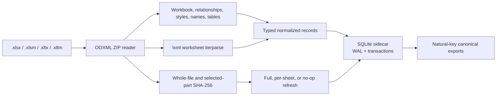

# Architecture

Excel LSP is a local, derived semantic index for modern Excel OOXML workbooks.
The verified P1 implementation streams workbook packages into a per-workbook
SQLite sidecar and refreshes that index from package hashes. Verified P2 adds
sparse regions, stable symbols, and the compact workbook map. Verified P3 adds
formula reference extraction and R1C1 blocks. Graph navigation, editing, MCP,
benchmarks, and release behavior
remain planned in their ordered phases.

## Layer boundaries

The package has three one-way layers:

- `excel_lsp.core` owns OOXML parsing, normalized values, index persistence,
  freshness, regions, symbols, and workbook maps, plus the future graph,
  diagnostics, and surgical editor. It has no MCP dependency and remains
  independently embeddable.
- `excel_lsp.server` will wrap core with stdio MCP schemas, response shaping,
  pagination, annotations, progress, path confinement, and sanitized errors in
  P7. It is currently only a package boundary.
- `excel_lsp.cli` will expose the same core operations for debugging and public
  demos. Its current verified surface is package help and version output; the
  workbook commands arrive with P7.

Transport code may depend on core. Core must never depend on MCP or the CLI.
The source workbook is authoritative; the SQLite database is disposable,
derived state.

## Verified P1 data flow

The parser reads ZIP members directly and streams worksheet cells through a
callback. It derives actual bounds from observed cells instead of trusting the
worksheet `<dimension>`. The shared normalization boundary emits JSON scalars;
dates become ISO-8601 strings, errors retain their Excel error text, and finite
numbers remain numeric.

The lifecycle first compares stored path, nanosecond modification time, and
size. A stat match is a no-op. Otherwise selected-part hashes decide whether to
refresh the complete workbook catalog, every sheet affected by a global value
part, or only sheets whose worksheet or related metadata changed. A byte-equal
file whose timestamp alone changed repairs bookkeeping without bumping the
semantic generation. Concurrent-save races retry once and then return a
structured error.

SQLite mutations use immediate transactions. Schema initialization and rebuild
are concurrency-safe, and an obsolete schema is replaced because the index is
always derivable. R*Tree capability is selected when available; an interval
table provides the same inclusive point/range interface when it is not. P1
initializes that storage abstraction, but P4 will populate and query the
semantic dependency graph.

Fresh P1 commands, oracle results, invariants, concurrency probes, coverage, and
review accounting are recorded in
[the P1 evidence report](evidence/p1-foundation.md).

## Verified P2 contract

P2 turns the normalized cell stream into sparse semantic regions and a bounded
workbook map. Its R-mech, R-test, and early R-repo gates have approved:

1. Native Excel ListObjects win and retain their declared ranges. Heuristic
   regions cannot overlap them.
2. Non-table regions are built from sparse per-row intervals and one
   height-independent span per anchored merged range, with blank gap tolerance
   bounded to 0–8 rather than a dense worksheet grid. Table-aware proximity
   and bounding-box closure run before fixed-order, component-local ListObject
   partitioning; directional children are recomputed separately.
3. Up to three candidate header rows use type, uniqueness, merge, and lazy style
   features. Every result carries `header_rows` and confidence from 0 to 1.
4. Column types sample at most 200 body cells; distinct counting is bounded.
   Merged multi-row headers join their visible text deterministically.
5. Identical content produces identical region ordinals. Every non-empty cell
   belongs to at most one region, and every ListObject range is exact.
6. The workbook map contains structure, headers, defined-name references,
   visibility, VBA presence, diagnostic counts, and navigation hints, but no
   cell values.
7. The F03 map must fit 1,500 `o200k_base` tokens. Every map, including F20,
   must fit 8,000 serialized characters through deterministic degradation.

The verified P2 milestone contains region inference, persistence integration,
frozen symbol constructors, deterministic F03/F20 fixtures, golden maps, and a
bounded map projection over indexed rows. See
[the P2 evidence report](evidence/p2-regions-map.md),
[index internals](index-internals.md), and the
[claims-to-artifacts plan](evidence/readme-claims-to-artifacts.md).

## Planned architecture by phase

| Phase | Component | Status boundary |
|---|---|---|
| P0 | Packaging, locked environment, CI and fixture scaffold | Verified |
| P1 | OOXML parser, SQLite store, spatial abstraction, freshness lifecycle | Verified |
| P2 | Regions, headers, stable symbols, compact workbook map | Verified |
| P3 | Formula reference classification and R1C1 formula blocks | Verified |
| P4 | Dependency graph, spatial edge queries, traces, paths, circular checks | Planned |
| P5 | Formula and workbook diagnostics | Planned |
| P6 | Surgical OOXML editing and transitive staleness | Planned |
| P7 | Fourteen-tool MCP server and full CLI | Planned |
| P8 | Live Excel protocol, benchmarks, headless-Codex evaluations, charts | Planned |
| P9 | Documentation, clean installs, CI matrix, public release and registries | Planned |

This phase boundary is intentional. A schema table or README contract can exist
before the behavior that populates it; public status follows the gate evidence,
not the presence of a placeholder module.

## Security and mutation boundary

P1 reads but never mutates source workbooks. P6 will be the first production
phase allowed to change a workbook, and only through surgical OOXML edits with
byte-identity proof for every untouched ZIP part. P7 adds the optional
`EXCEL_LSP_ROOT` realpath boundary around all agent-supplied paths. The complete
pre-release threat model is in [`SECURITY.md`](../SECURITY.md).
